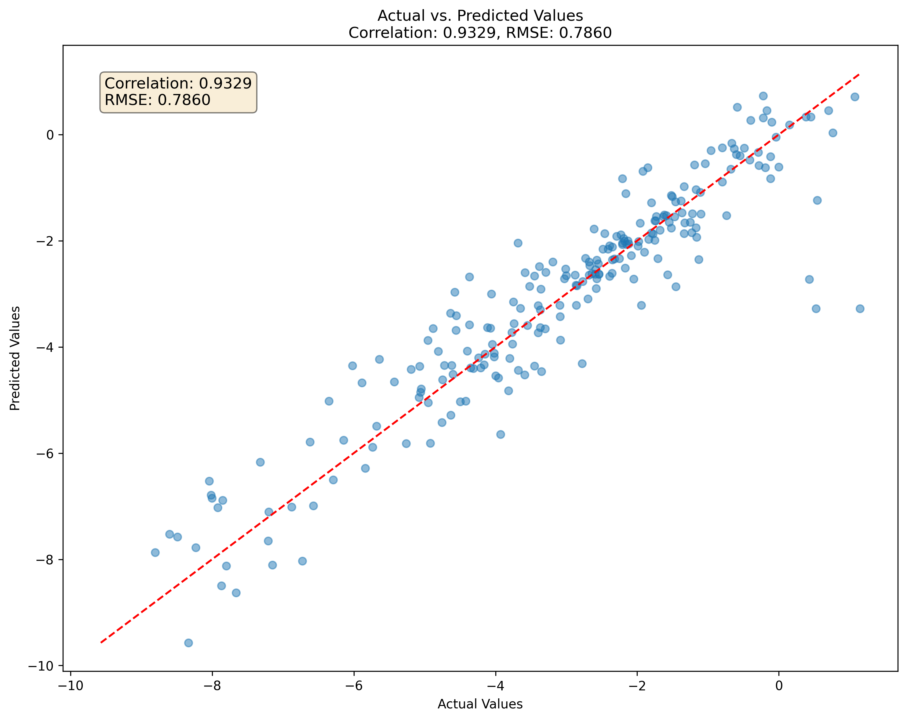
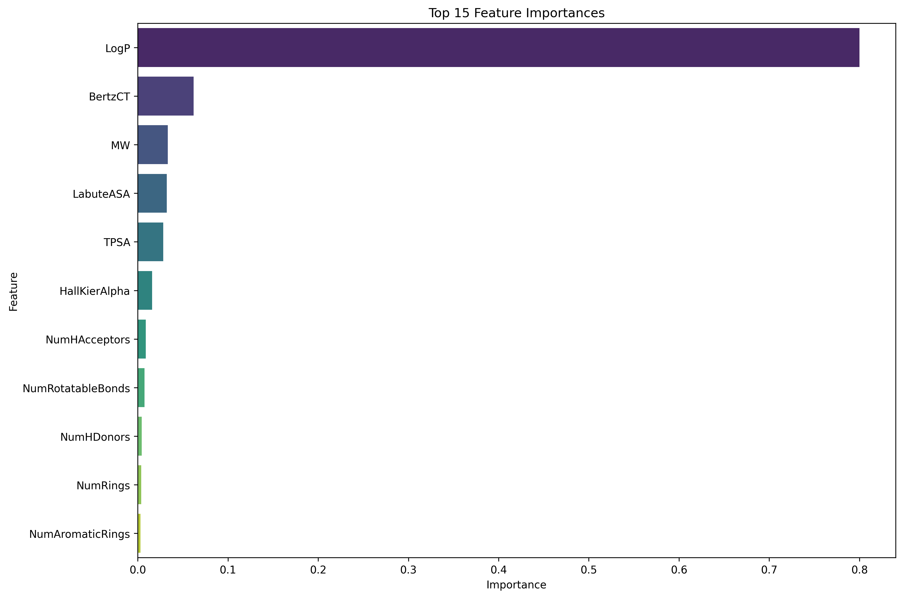

# Molecular Property Prediction

A machine learning project that predicts molecular solubility (LogS) from chemical structures using RDKit and scikit-learn.



## Project Purpose

This project demonstrates how to build a robust machine learning pipeline to predict molecular properties from chemical structures. Specifically, it:

- Predicts aqueous solubility (LogS) of small molecules from their SMILES representation
- Leverages RDKit to calculate molecular descriptors (fingerprints)
- Uses Random Forest regression with optimized hyperparameters
- Provides both programmatic and script-based interfaces for making predictions

Molecular solubility prediction is critical in drug discovery and development, as it influences a compound's bioavailability, formulation options, and overall developability.

## Dataset

The model is trained on the Delaney ESOL dataset, which contains:
- 1128 small molecules with experimental solubility measurements
- Diverse chemical structures represented as SMILES strings
- Measured LogS values (logarithm of solubility in mols per liter)

## How the Model Works

The prediction process follows these steps:

1. **Data Processing**: SMILES strings are parsed using RDKit
2. **Feature Engineering**: Molecular descriptors are calculated, including:
   - Physicochemical properties (MW, LogP, TPSA)
   - Topological features (BertzCT, HallKierAlpha)
   - Structural counts (rings, rotatable bonds, H-bond donors/acceptors)
3. **Model Training**: Random Forest Regression with hyperparameter optimization via cross-validation
4. **Prediction**: New molecules are processed through the same feature engineering pipeline before prediction

The model achieves strong performance through:
- Robust feature engineering of relevant molecular descriptors
- Hyperparameter tuning to optimize model parameters
- Cross-validation to ensure generalizability

## Installation and Setup

```bash
# Clone the repository
git clone https://github.com/quantnexusai/molecular-property-prediction.git
cd molecular-property-prediction

# Create and activate virtual environment
python -m venv venv
source venv/bin/activate  # On Windows: venv\Scripts\activate

# Install dependencies
pip install -r requirements.txt
```

## Usage

### Training the Model

To train the model on the dataset:

```bash
python main.py
```

This will:
1. Process the Delaney dataset
2. Generate molecular descriptors
3. Train and optimize a Random Forest model
4. Evaluate performance and generate visualization figures
5. Save the trained model to the `models/` directory

### Making Predictions

To predict solubility for new compounds:

```bash
python predict_new_compounds.py
```

You can modify the `predict_new_compounds.py` script to include your own SMILES strings:

```python
# Add your compounds here
new_smiles = [
    'CC(=O)OC1=CC=CC=C1C(=O)O',  # Aspirin
    'CN1C=NC2=C1C(=O)N(C(=O)N2C)C',  # Caffeine
    # Add your compounds...
]
```

## Model Performance

The Random Forest model achieves:

- **RMSE (Root Mean Square Error)**: 0.786
- **MAE (Mean Absolute Error)**: 0.538
- **R² (Coefficient of Determination)**: 0.869

This indicates that the model explains approximately 87% of the variance in the solubility data.

### Top Predictive Features



The most important molecular descriptors for solubility prediction include:
- LogP (octanol-water partition coefficient)
- Molecular Weight (MW)
- Topological Polar Surface Area (TPSA)
- Number of H-bond donors and acceptors

## Project Structure

```
molecular-property-prediction/
├── data/               # Data files
│   ├── raw/            # Raw input data
│   └── processed/      # Processed data with features
├── figures/            # Visualizations and plots
├── models/             # Saved model files
├── notebooks/          # Jupyter notebooks
│   ├── 01_data_preparation.ipynb
│   └── 02_model_development.ipynb
├── src/                # Source code
│   ├── features/       # Feature engineering code
│   ├── models/         # Model training and prediction
│   └── visualization/  # Visualization utilities
├── tests/              # Unit tests
├── main.py             # Main execution script
├── predict_new_compounds.py  # Script for new predictions
└── README.md           # Project documentation
```

## Future Improvements

- Implement additional molecular fingerprints and descriptors
- Explore deep learning approaches (graph neural networks)
- Add web interface for online predictions
- Expand to other molecular properties (LogP, bioactivity, etc.)
- Include uncertainty estimates with predictions

## License

MIT

## Contact

Ari Harrison - [ari@quantnexus.ai](mailto:ari@quantnexus.ai)

Project Link: [https://github.com/quantnexusai/molecular-property-prediction](https://github.com/quantnexusai/molecular-property-prediction)